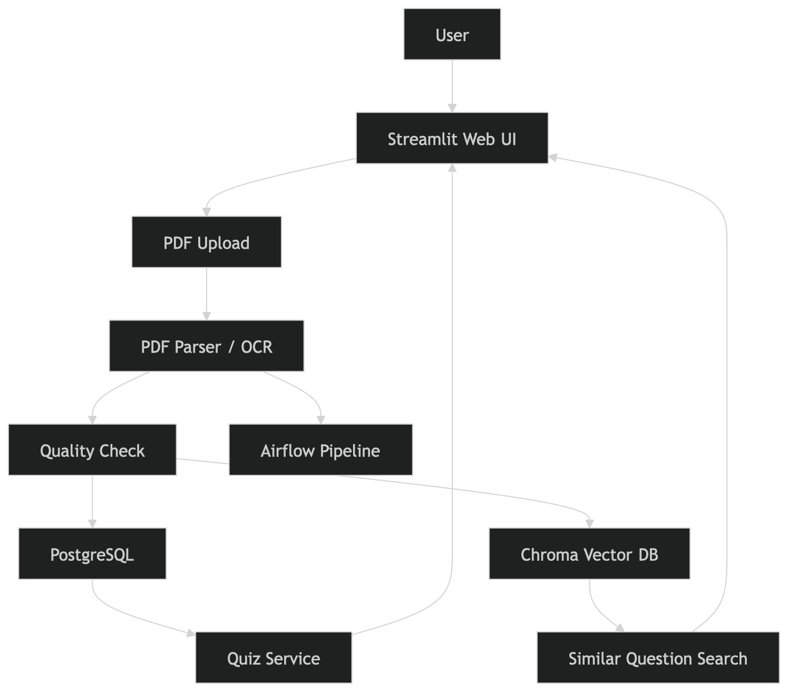
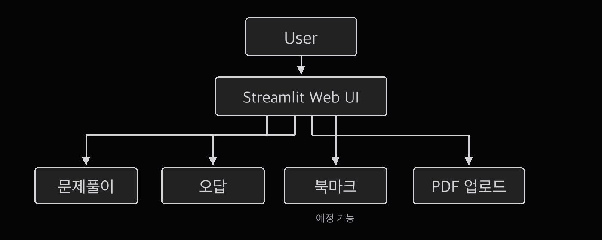
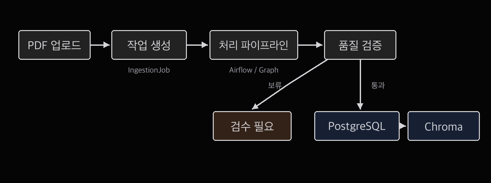

# 02. 시스템 아키텍처

## 1. 개요

이 프로젝트는 자격증 시험 문제 PDF를 업로드하고, 문제를 구조화하여 웹에서 풀 수 있도록 만드는 학습용 문제풀이 웹 애플리케이션입니다.

현재 목표는 단순한 문제풀이 웹을 넘어서, PDF 기반 비정형 시험 자료를 정형 데이터로 변환하고, 사용자가 문제풀이, 정답 확인, 오답 관리, 유사 문제 검색을 할 수 있는 구조를 만드는 것입니다.

## 2. 전체 아키텍처 요약

현재 시스템은 다음 구성 요소로 이루어집니다.

| 구성 요소 | 역할 |
| --- | --- |
| Streamlit | 사용자 화면 제공, PDF 업로드, 문제풀이 UI |
| PostgreSQL | 문제, 보기, 정답, 해설, 사용자 풀이 기록 저장 |
| Chroma | 문제 임베딩 저장, 유사 문제 검색 |
| Learning Lab Service | Track, 로드맵, 이론 카드, 확인 퀴즈, 실습 샘플 제공 |
| Learning Progress Service | 마지막 선택 Track, 이어서 공부 진행률, 누적 학습 단위 저장 |
| Question Type Metadata | 다양한 문제 유형 이름을 내부 표준 유형으로 정리 |
| Answer Normalizer | 객관식, 복수 선택, Yes/No, 순서형 답안을 비교 가능한 형태로 정규화 |
| Airflow | PDF 처리, 파싱, 임베딩, 저장 작업의 파이프라인 관리 |
| Docker / Docker Compose | 개발 및 실행 환경 표준화 |
| Oracle Cloud Ubuntu | 향후 서비스 배포 대상 서버 |

## 3. 첨부 다이어그램 검토

첨부한 다이어그램의 큰 방향은 맞습니다. 사용자가 Streamlit Web UI에 접속하고, PDF 업로드와 문제풀이 기능을 사용하며, PostgreSQL과 Chroma를 함께 사용하는 구조는 현재 프로젝트 방향과 잘 맞습니다.

다만 현재 코드 구조 기준으로는 아래처럼 이해하는 것이 더 정확합니다.

- Airflow는 Parser/OCR 뒤에 붙는 별도 저장 단계라기보다, 긴 PDF 처리 작업 전체를 백그라운드에서 실행하고 추적하는 역할입니다.
- PDF Parser/OCR, Quality Check, PostgreSQL 저장, 문제 분류/검증은 `PDF Ingestion Graph` 안의 단계로 보는 것이 자연스럽습니다.
- Quiz Service는 PostgreSQL에 저장된 문제와 풀이 기록을 읽고 씁니다.
- Similar Question Search는 Chroma에서 유사 문제를 찾고, 실제 문제 데이터는 PostgreSQL의 문제 ID와 연결해서 보여주는 구조가 좋습니다.
- Chroma는 현재 별도 서버형 DB라기보다 `chroma_db` 디렉터리를 사용하는 로컬 벡터 저장소 형태입니다.

정리하면 첨부 다이어그램은 개념적으로 맞지만, 문서에서는 Airflow를 “파이프라인 실행 관리자”로, PostgreSQL을 “기준 데이터 저장소”로, Chroma를 “검색용 보조 색인”으로 표현하는 것이 더 정확합니다.

## 4. 사용자 관점 흐름

사용자는 웹 화면에 접속한 뒤 이어서 공부, 집중 학습, 시험 대비, 대시보드, 문제풀이, PDF 업로드 기능을 사용할 수 있습니다.

사용자 기능 흐름은 아래 이미지처럼 정리할 수 있습니다.

현재 구현은 홈을 단순 시작 화면으로 두고, 진도와 추천 복습은 별도 대시보드에서 확인하는 구조입니다. 문제풀이, PDF 업로드, 오답/복습, 개념 정리, 처리 현황, 시험 현황, AI 색인 흐름은 유지하며, 그 위에 Track 기반 이론 학습과 확인 퀴즈를 얹고 있습니다. 북마크는 향후 개선 기능으로 두고 있습니다.

## 5. 전체 서비스 흐름

전체 서비스 흐름은 위 이미지처럼 사용자가 Streamlit 화면에 접속하고, PDF 업로드와 문제풀이 기능을 사용하는 형태입니다.

현재 코드 기준으로는 Streamlit 화면이 `QuizService`, `LearningLabService`, `LearningProgressService`, `IngestionJobService`, `QuestionVectorStore` 같은 서비스 계층을 호출하고, PDF 처리처럼 시간이 오래 걸리는 작업은 Airflow DAG와 PDF Ingestion Graph를 통해 단계별로 실행됩니다.

학습 화면 쪽은 다음처럼 나눕니다.

| 화면 | 역할 |
| --- | --- |
| 홈 | 이어서 공부, 집중 학습, 시험 대비, 대시보드로 들어가는 가벼운 시작 화면 |
| 이어서 공부 | 마지막으로 선택한 Track을 기준으로 이론, 퀴즈, 오답 복습을 계속 진행 |
| 집중 학습 | 이론만 보기, 퀴즈만 풀기, 실습 집중처럼 원하는 학습 모드 선택 |
| 시험 대비 | AZ-104 문제풀이, 세부개념 반복, 시험 모드 진입 |
| 대시보드 | Track 진행률, 연속 학습일, 오늘/주간 누적 학습 단위, 추천 복습 확인 |

문제풀이 흐름에서는 문제 유형이 여러 이름으로 들어올 수 있기 때문에 `question_type_metadata_service.py`에서 먼저 표준 유형으로 정리합니다. 예를 들어 `Hotspot (True/False)`는 내부적으로 Yes/No 진술형으로, `Hotspot (Drag and Drop)`은 매칭형으로 다룹니다.

정답 비교는 `answer_normalizer.py`를 통해 처리합니다. 이 계층은 `Y,N,Y`, `예/아니오`, 복수 선택, 순서가 중요한 답안을 비교 가능한 문자열로 정리합니다. 이렇게 해 두면 화면 UI와 채점 로직이 서로 다른 기준으로 동작하는 문제를 줄일 수 있습니다.

## 6. PDF 처리 흐름

PDF 업로드 이후에는 파싱 과정을 통해 문제를 추출하고, 문제/보기/정답/해설 형태로 구조화합니다.

구조화된 문제 데이터는 PostgreSQL에 저장하고, 유사 문제 검색에 필요한 텍스트는 임베딩하여 Chroma에 저장하는 구조를 목표로 합니다.

실제 코드에서는 `cert_study_app/graphs/pdf_ingestion_graph.py`의 PDF ingestion graph가 이 흐름을 단계별로 관리합니다.

현재 주요 단계는 다음과 같습니다.

1. 처리 시작
2. PDF 파싱
3. 파싱 품질 검증
4. 품질 게이트
5. 문제 저장
6. 문제 유형 분류
7. 이미지/시각 정보 분석
8. 최종 검증
9. 처리 완료

파싱 품질 검증에서도 문제 유형 표준화 결과를 사용합니다. 시각형 문제를 일반 객관식으로 잘못 보고 `보기가 부족하다`고 판단하는 일을 줄이기 위한 구조입니다.

## 7. 데이터 저장 구조

이 시스템에서는 PostgreSQL과 Chroma를 함께 사용합니다.

PostgreSQL은 문제, 보기, 정답, 해설, 사용자 풀이 기록처럼 구조화된 데이터를 저장합니다. 예를 들어 특정 사용자가 어떤 문제를 맞혔는지, 어떤 문제가 오답 복습 대상인지 같은 데이터는 관계형 데이터베이스에 저장하는 것이 적합합니다.

Chroma는 문제 본문을 벡터로 저장하여 유사 문제 검색에 사용합니다. 예를 들어 사용자가 특정 문제를 틀렸을 때, 비슷한 유형의 문제를 찾아 복습할 수 있도록 하기 위해 사용합니다.

PostgreSQL은 기준 데이터 저장소이고, Chroma는 검색을 위한 보조 색인입니다. Chroma가 PostgreSQL을 대체하는 구조는 아닙니다.

학습 진행 데이터는 현재 `data/learning_progress.json`에 저장합니다. 여기에는 마지막 선택 Track, 날짜별 학습 단계, 이론/퀴즈/실습/문제풀이/복습 활동 수가 들어갑니다. 이 파일은 개인 로컬 진행 상태에 가깝기 때문에 Git에 올리는 기준 데이터가 아니라 런타임 데이터로 봅니다.

현재 저장 역할을 정리하면 다음과 같습니다.

| 저장 위치 | 성격 | 예시 |
| --- | --- | --- |
| PostgreSQL | 기준 문제/풀이 데이터 | 문제, 정답, 해설, 풀이 기록 |
| Chroma | 검색용 보조 색인 | 문제 임베딩, 유사 문제 검색 |
| `data/learning_progress.json` | 개인 학습 진행 상태 | 선호 Track, 누적 학습 단위 |
| `cert_study_app/demo_data/questions_seed.json` | 배포용 seed | Hugging Face 초기 문제 데이터 |

## 8. Airflow 사용 이유

PDF 처리 과정은 한 번에 끝나는 단순 작업이 아니라 여러 단계로 나뉩니다.

1. PDF 업로드
2. 텍스트 추출 또는 OCR 보정
3. 문제 단위 파싱
4. 정답/해설 구조화
5. 파싱 품질 검증
6. PostgreSQL 저장
7. 임베딩 생성
8. Chroma 저장

이런 작업은 순서가 중요하고, 중간에 실패할 수도 있기 때문에 Airflow를 사용하여 파이프라인으로 관리합니다.

현재는 개발 단계이므로 모든 기능이 완전히 자동화되어 있지 않을 수 있지만, 향후 안정적인 문제 처리 배치를 위해 Airflow를 적용하는 방향으로 설계하고 있습니다.

현재 DAG 파일은 다음과 같습니다.

- `dags/cert_study_pdf_ingestion_dag.py`
- `dags/cert_study_visual_analysis_dag.py`

## 9. Docker 사용 이유

Docker는 개발 환경과 배포 환경을 최대한 동일하게 만들기 위해 사용합니다.

현재 프로젝트는 Streamlit, PostgreSQL, Chroma, Airflow처럼 여러 구성 요소를 사용합니다. 이들을 로컬 MacBook이나 Oracle Cloud Ubuntu에서 동일하게 실행하려면 환경 차이를 줄이는 것이 중요합니다.

Docker Compose를 사용하면 여러 서비스를 하나의 설정 파일로 실행할 수 있습니다.

현재 `docker-compose.yml`의 주요 서비스 구성은 다음과 같습니다.

| 서비스 | 역할 |
| --- | --- |
| `cert-study-app` | Streamlit 사용자 웹 화면 |
| `postgres` | 문제 및 풀이 데이터 저장 |
| `airflow-init` | Airflow 초기 설정 |
| `airflow-webserver` | Airflow 관리 화면 |
| `airflow-scheduler` | 파이프라인 스케줄 실행 |

Chroma는 별도 컨테이너라기보다 현재 프로젝트의 `chroma_db` 디렉터리를 통해 앱에서 사용하는 로컬 벡터 저장소 형태로 관리됩니다.

## 10. 배포 구조

향후에는 Oracle Cloud Ubuntu 서버에 Docker 기반으로 배포하는 것을 목표로 합니다.

초기에는 개인 사용 목적이므로 복잡한 Kubernetes 구조보다는 Docker Compose 기반 배포를 우선 검토합니다. 운영 요구사항이 커지면 Nginx, HTTPS, 백업, 모니터링 등을 추가할 수 있습니다.

## 11. 현재 구현 상태

현재 프로젝트는 개발 중이며, 다음 기능을 중심으로 구현하고 있습니다.

- Streamlit 기반 문제풀이 화면
- 문제 유형 표준화 및 정답 정규화 구조
- PDF 업로드 및 파싱 구조
- PostgreSQL 기반 문제 데이터 저장
- Chroma 기반 유사 문제 검색 구조
- Docker 기반 실행 환경 구성
- Airflow 기반 파이프라인 구조
- Oracle Cloud Ubuntu 배포 준비
- Track 기반 이어서 공부, 집중 학습, 시험 대비, 대시보드 기본 화면
- 마지막 선택 Track 저장 및 누적 학습 단위 기록

## 12. 향후 개선 방향

향후 개선할 기능은 다음과 같습니다.

- 관리자 로그인
- 사용자별 학습 이력 관리
- 오답노트 자동 생성
- 북마크 기능
- 카테고리별 문제 분류
- 학습 진행 데이터를 JSON에서 DB 테이블로 이전
- 문제 유형별 테스트 범위 확대
- LLM 기반 해설 보조 생성
- 유사 문제 추천
- PDF 파싱 실패 케이스 관리
- Oracle Cloud 배포 자동화
- 정기 백업 및 로그 관리
